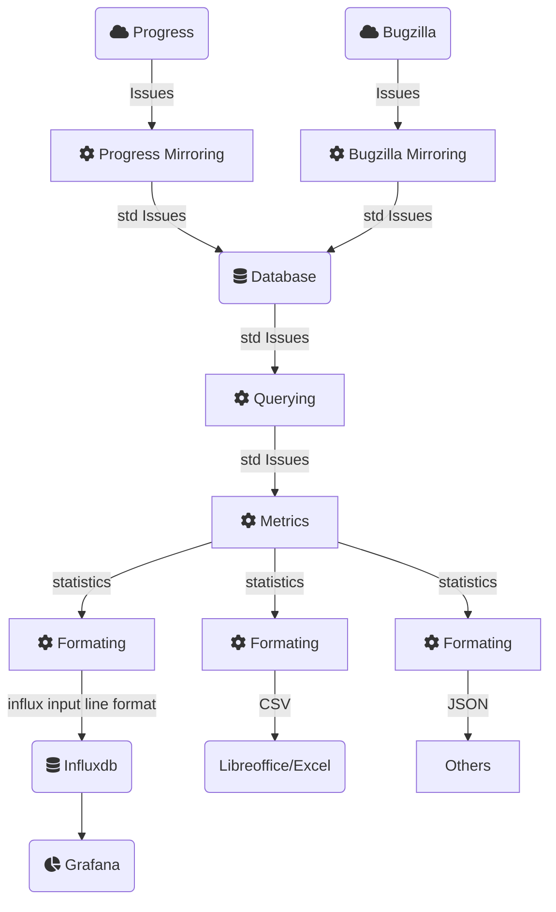

# project_management_statistics

## Structure



## Usage

### Dumping progress issues into local DB for further processing

1. Create the a redmine config file as a python file. e.g. `config.py`
2. define following variables in this file:
    - REDMINE_URL - URL to target Redmine from where tickets will be dumped
    - REDMINE_KEY - API key allowing to access REDMINE_URL
    - REDMINE_QUERY_RATIO - Max request per minute to the redmine API
3. execute :

```bash
podman run  -ti --rm -v <your_redmine_config_path>:/pms/redmine/config.py pms "./dumper.py --project <project_name> --database <sqlite_file> "
```

## Querying

Import SQLiteQuery

```
from db.sqlite_query import SQLiteQuery
```

Create the object

```
query = SQLiteQuery(<file>)
```

### Methods


#### query.issues(**filters)
Get all issues
params:
* filter: A dict of filters e.g. project_id=1
return: A list of issues

#### query.status_snapshot(date, **filters)
Get all the active and resolved issues with the status in a especific moment
params:
* date (datetime): The date for the snapshot. None means the last values
* *filter: A dict of filters e.g. project_id=1
return: A list of issues

e.g.

```
result = query.status_snapshot(date=datetime(2023, 1, 1), project_id=1)
```

#### query.issues_active_in_period(date_in, date_out, **filters)
Get all the issues that are active (not closed) during a period of time
params:
* date_in (datetime): The begining of the period
* date_out (datetime): The end of the period
* filter: A dict of filters e.g. project_id=1
return: A list of issues


## Metrics

Import Metrics and SQLiteQuery if is necessary
```
from metrics.metrics import Metrics
from db.sqlite_query import SQLiteQuery
```

Create the objects
```
query = SQLiteQuery(<file>)
metrics = Metrics(query)
```

### Methods

#### metrics.status_count(**filters)
Classify the issues by status and return the ammount in each category
params:
* filter: A dict of filters e.g. project_id=1

return: A dict with the format <status_id:count>

### status_count_by_date(date, **filters)
Classify the issues by status and return the ammount in each category
params:
* filter: A dict of filters e.g. project_id=1

return: A dict with the format <status_id:count>


## Formatters

The formatters allow to convert a result from the metrics to an specific format.

- InfluxDB input line format
- CSV
- JSON

Use the static method format to convert a MetricsResult (result from metrics queries)
into the format recognized by influxdb, CSV, or JSON for populating a database or other systems.

#### MetricsInfluxdbFormatter
```
from metrics.influxdb_formatter import MetricsInfluxdbFormatter
MetricsInfluxdbFormatter.format(measurement_name: str, metrics: MetricsResults)
```

params:
* measurement_name: Measurement name for the influx db
* metrics: MetricsResults
return: A formated string compabible with influxDB

#### MetricsCSVFormatter
```
from formatters.csv_formatter import MetricsCSVFormatter
MetricsInfluxdbFormatter.format(measurement_name: str, metrics: MetricsResults, separator: str = ",")
```

params:
* measurement_name: Measurement name for the influx db
* metrics: MetricsResults
* separator: str
return: A CSV formated string

#### MetricsJSONFormatter
```
from formatters.csv_formatter import MetricsCSVFormatter
MetricsInfluxdbFormatter.format(measurement_name: str, metrics: MetricsResults)
```

params:
* measurement_name: Measurement name for the influx db
* metrics: MetricsResults
* separator: str
return: A JSON string

JSON schema
```
{
    name: str,
    filters: dict,
    values: [ {
        values: dict,
        date: str(ISO 8601 time format)
    }]
}
```
e.g. `{'name': 'test', 'filters': {'f1': 1}, 'values': [{'values': {'v1': 1}, 'date': '2023-03-14T13:31:06.596142'}]}`


## Containers

### Create the containers

There are four alternatives:

- podman-container: Create the main container using podman
- podman-container-test: Create the container for testing using podman
- docker-container: Create the main container with docker
- docker-container-test: Create the container for testing using docker

e.g.

```bash
make docker-container
```

The containers created are:

- **pms**: For the main container
- **pms_test**: For the testing container

### Execution

With podman or docker

```bash
podman run --rm pms <command>
```

### Testing

With podman or docker

```bash
podman run --rm pms_test make test
```

### Development in a container

With podman or docker

```bash
podman run -ti --rm -v <your_code_path>:/pms pms_test bash
```

## Scripts

### Metrics By Period

The `metrics_by_period.py` script is designed to loop over a range of dates and apply a specified metric to each date. 
This script is useful for time series analysis and visualization of date-based metrics.

#### Parameters

Below are the parameters accepted by the `metrics_by_period.py` script:

- `--start_date`: Start date in the format `YYYY-MM-DD`. If not provided, the script defaults to the Unix epoch (1970-01-01).

- `--end_date`: End date in the format `YYYY-MM-DD`. If not provided, the script defaults to the current date.

- `database`: Name of the database file to write the results to.

- `--metric`: Name of the method to apply to each date. Defaults to `status_count`.

- `--output_format`: Output format for the results. Valid options are `json`, `influxdb`, and `csv`. Defaults to `influxdb`.

- `--measurement_name`: The name of the measurement used in InfluxDB. Defaults to `metrics`.

### Usage

To use the script, provide the necessary parameters as command line arguments:

```bash
python metrics_by_period.py --start_date 2022-03-01 --end_date 2023-03-30 --database my_database.db --metric status_count --output_format influxdb --measurement_name my_measurement
```

## Developer

### Prepare the venv

```bash
python3 -m venv venv
source venv/bin/activate
pip3 install -r requirements_test.txt
```

### Testing with redmine

If you have already a redmine/config.py skip this step
```bash
cp ./redmine/config_example.py ./redmine/config.py
```

Run the tests with
```bash
make test
```