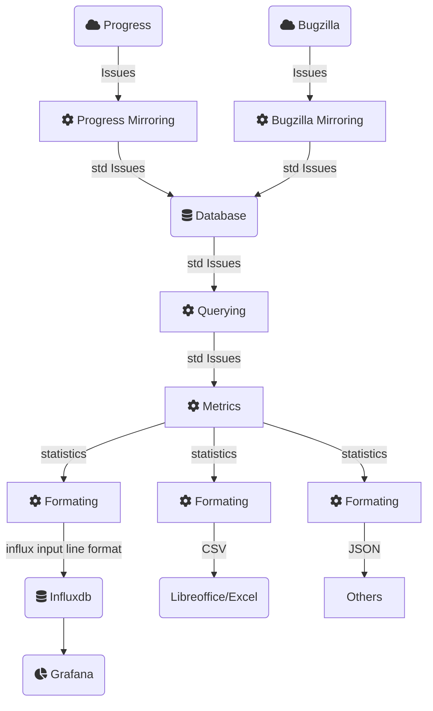

# Project Management Statistics

Taking a comprehensive approach, it's important to recognize that ticket systems such as Issues and IssueEvents usually only store raw data.
Through the processing and analysis facilitated by this project, we transform this data into valuable information 
that can be used for in-depth analysis or making informed decisions.

The motivation for this project is based on the challenges and limitations encountered while generating metrics using Telegraf and directly querying APIs.
These challenges highlight the need for a more efficient and robust solution to capture historical data and calculate meaningful metrics.

Telegraf serves its intended purpose effectively; however, the project we are proposing offers a potentially more effective and comprehensive solution 
for designing and exploring new metric formulas. By capturing and storing historical data, this project aims to enhance the process of generating metrics 
by addressing the limitations observed in the Telegraf approach.

The primary motivation for this project is the utilization of historical data, which offers several advantages when it comes to metrics.
Some key benefits of using historical data in this context include:

- **Efficient metric validation**: With historical information, you can validate metrics during the design phase,
leading to well-crafted metrics in production without waiting for days of collected data.
- **Consistent metric modification**: Historical data allows you to recalculate the entire metric with an updated formula, ensuring consistency throughout,
rather than having changes apply only from the moment of implementation.
- **Overcoming API limitations**: You can bypass API security restrictions and response speed constraints, enabling and speeding up the calculation of complex metrics.
- **Comprehensive metrics**: Unlike directly querying APIs and relying on the present moment, historical data offers a more comprehensive view of issue states, leading to more accurate metrics.
- **Resilience during downtime**: If a monitoring tool like Telegraf goes offline, historical data ensures that you won't miss any metrics generated during the downtime.
- **Advanced complexity and trend analysis**: Access to historical data enables the creation of complex metrics based on trends and issue evolution over time, offering deeper insights.

## Workflow

This project uses a database schema to store and manage issues from different issue tracking systems. 
The schema is illustrated in the following diagram:



In this project, we follow a structured workflow to process and analyze data from different sources:

1. **Multiple data sources**: The data comes from various ticket systems, such as Progress and Bugzilla.
2. **Mirroring process**: We use mirroring scripts to process the raw data from these sources and store it in a common database using standardized models.
3. **Querying process**: We can query this database independently of the data source, enabling seamless access to the stored information.
4. **Metrics generation**: The metrics process takes the query result (standardized data) and generates relevant metrics based on our needs and requirements.
5. **Formatting and output**: Once the metrics have been generated, we format the results into a comprehensible output for different destinations.
This could include InfluxDB for visualization in Grafana, CSV files for use in spreadsheet applications like LibreOffice or Excel, or JSON files for integration 
with other applications that can read and process JSON data.

By following this workflow, we ensure a smooth and efficient process for handling, analyzing, and generating valuable information from raw data across multiple ticket systems.

### Database

Using a database with a normalized model offers several benefits over directly connecting to APIs:

- **Enhanced performance**: By storing issues in a local (or remote) database, you can bypass limitations imposed by APIs, 
such as maximum query rates per second. This enables faster access to the information you need.
- **Scalable data retrieval**: By leveraging a database, you can fetch a larger number of issues per query,
allowing you to handle a growing number of tickets with ease. Avoiding an other one possible limitation of APIs.
- **Complete history for metric exploration**: A database enables you to store and maintain the complete history of issue changes for a project,
providing valuable context when exploring and designing new metrics. 
This comprehensive historical data allows you to instantly overview the evolution of a metric without waiting for additional data collection.
As a result, you can quickly refine and adjust the metric during the design phase, ensuring that it accurately reflects the desired insights and trends.
- **Simplified data extraction**: With a normalized model, you can consolidate multiple queries into a single request, 
streamlining the data extraction process and reducing the complexity of your code.
- **Cross-platform compatibility**: A normalized model ensures compatibility between different issue tracking systems,
making it easier to integrate multiple platforms and facilitating collaboration between teams using different tools.
- **Consistent data formats**: Normalizing the data in a database guarantees a consistent format for all issues,
simplifying data analysis and reporting while reducing the need for manual data normalization. 
This consistent format is beneficial not only for product owners and scrum masters who usally manage a single project,
but also for managers who need to maintain an overview of multiple projects across the department.
By having a unified data format, managers can efficiently track progress, evaluate performance, and make data-driven decisions across all projects,
ensuring better alignment with organizational goals and objectives.

### Normalized Model

By utilizing a normalized model for Issue, IssueEvent, and IssueAttribute, we can combine different sources into the same metrics.
This is particularly useful for teams working with different ticket systems and management perspectives. Or for managers to have an overview of the department

### Issue

The Issue model contains the common fields expected from a ticket system and provides the last status (and snapshot) of the ticket. These fields include:

- **issue_id**: A unique identifier for the issue within its specific ticket system.
- **created_on**: The date and time when the issue was created.
- **start_date**: The date and time when work on the issue began (usually is considered that the issue is "in progress" from this point).
- **closed_on**: The date and time when the issue was closed.
- **status**: The current status of the issue, such as "open", "in progress", or "closed".
- **priority**: The priority level of the issue, which can help in determining the order of work.
- **context_key**: A string used to filter issues that belong to different groups or contexts. In different ticket systems, this context can vary. 
For example, in the Progress ticket system, the context may be the project, while in Bugzilla, it could be a combination of the product, version, etc.

The other fields are:

- **author**: The name of the user who created the issue.
- **assigned_to**: The name of the user to whom the issue is currently assigned.
- **subject**: A brief description or title of the issue.
- **due_date**: The date and time when the issue is expected to be completed.
- **estimated_hours**: The estimated number of hours required to complete the issue.
- **updated_on**: The date and time when the issue was last updated.

By storing these fields in the Issue model, you can efficiently filter, sort, and analyze issues from various ticket systems in a consistent format.

#### Context key
The context_key is designed to help you filter and group issues that belong to different contexts or groups, such as projects, products, or versions.
It is essential to define the context_key in a consistent and meaningful way to make it easy to work with issues from various ticket systems.

To define the context_key, you can follow a standard format, combining relevant context elements and separating them with a delimiter
like a period (.) or a hyphen (-). In the example you provided, the context_key is created by concatenating the product,
version, and an additional numeric identifier:

e.g. product1.version1-4

Here's a step-by-step guide to defining a context_key:

- Identify the relevant context elements for your issue tracking system. For example, in Bugzilla, you may want to include the product and version,
while in the Progress, you might only need the project.
- Choose a consistent delimiter to separate the elements in the context_key. Common delimiters include periods (.), hyphens (-), or underscores (_).
- Combine the context elements using the chosen delimiter to form the context_key.

By consistently defining the context_key in this manner, you can easily filter, sort, and analyze issues that belong to different contexts while 
maintaining compatibility between different ticket systems.

### IssueAttribute

In addition to the main fields stored in the Issue model, you may encounter other attributes specific to a particular ticket system or relevant to your unique use case.
To accommodate these additional attributes, you can use the IssueAttribute model.

The IssueAttribute model is designed to store key-value pairs associated with an issue. Each entry in this model includes an issue_id (which links it to the corresponding issue),
a key representing the attribute's name, and a value representing the attribute's content.

By storing these additional attributes in the IssueAttribute model, you can capture and preserve valuable information that is not part of the common fields in the Issue model.
This flexible approach allows you to store custom attributes from various ticket systems, enabling more in-depth filtering, analysis, and reporting.

For example, if you encounter a custom attribute called "Version" in one of the ticket systems, you can store it in the IssueAttribute model as follows:

- issue_id: The ID of the issue that has the "Version" attribute.
- key: "Version"
- value: The actual value of the "Version" attribute.

This approach ensures that all relevant data is captured and stored, allowing you to create more accurate and comprehensive metrics and reports.

### IssueEvent

The IssueEvent model plays a crucial role in capturing the history of changes that occur to an issue throughout its lifecycle.
By recording these events, you can better understand the evolution of issues, analyze trends, and assess the effectiveness of your team's processes.

The IssueEvent model includes the following fields:

- **issue_id**: A foreign key reference to the associated issue in the Issue model.
- **user_name**: The name of the user who performed the change.
- **created_on**: The date and time when the event occurred.
- **type**: The type of change, such as "status change", "priority change", or "assignment".
- **field**: The field that was modified during the event.
- **old_value**: The previous value of the modified field before the event occurred.
- **new_value**: The updated value of the modified field after the event occurred.

By storing issue events in the IssueEvent model, you can analyze the historical changes and trends for each issue, such as the frequency of status changes,
priority adjustments, or user assignments. This information can help you identify potential areas for improvement, and the effectiveness of your team's processes.
Additionally, maintaining a record of issue events can provide valuable context when exploring and designing new metrics, ensuring that they accurately reflect the desired insights and trends.

### Database System

The current database system is SQLite, which is native to Python and easily portable. However, this can be replaced with any SQL (MariaDB, PostgreSQL, etc.) or NoSQL (MongoDB, etc.) system.

## Usage from user perspective

### Dumping progress issues into local DB for further processing (Redmine)

To set up the environment for dumping Progress issues into a local database for further processing, follow these steps:

1. Create a file named redmine_config.yaml at the root of your project. Use the following structure for the file:

```yaml
REDMINE:
  url: <REDMINE_URL>  # The URL to target the Redmine instance from where tickets will be dumped.
  key: <REDMINE_API_KEY>  # The API key that allows access to the REDMINE_URL.
  query_ratio: <MAX_REQUESTS_PER_MIN>  # The maximum number of requests per minute to the Redmine API.

STATUS_CODE_TO_STRING:
  '1': 'NEW'
  '2': 'IN PROGRESS'
  '3': 'RESOLVED'
  '4': 'FEEDBACK'
  '5': 'CLOSED'
  '6': 'REJECTED'
  '12': 'WORKABLE'
  '15': 'BLOCKED'
```

Replace <REDMINE_URL> with the URL of your Redmine instance, <REDMINE_API_KEY> with your API key,
and <MAX_REQUESTS_PER_MIN> with the maximum number of requests per minute allowed by Redmine API.

2. Execute the following command, replacing <project_name> and <sqlite_file> with appropriate values:

```bash
podman run -ti --rm -v $(pwd)/redmine_config.yaml:/pms/redmine_config.yaml pms "./dumper.py \
  redmine --project <project_name> --database <sqlite_file>"
```
    
This command runs the dumper.py script, which will dump the Progress issues from Redmine into the specified SQLite file. Ensure that you have the pms container available.

Once you have completed these steps, you will obtain an SQLite file containing the dumped database with all the relevant Progress issues.
If the database already exists, the dumper script will update it with the latest information from Redmine,
ensuring that your local database remains up-to-date for further processing and analysis.

It is recommended to reuse the previously dumped DB file, as the script is designed to update the existing database efficiently,minimizing API calls.
By optimizing the update process, the script reduces the load on the Redmine API and helps prevent reaching any imposed rate limits, preventing IP abbuse blocker systems.

### Generating metrics

#### Filter Arguments

Before seing the different scripts, we need to understand the filter arguments.
The filter arguments allow you to filter your data based on specific conditions.
You can use these arguments to filter by project, type, tags, context, status, priority, author, or assigned_to. Additionally,
you can provide a JSON string to define more complex filters.

##### Basic Usage

To filter by project, type, tags, context, status, priority, author, or assigned_to, you can use the following flags:

```bash
--filter-project <project_name>
--filter-type <type_name>
--filter-tags <tag_name>
--filter-context <context_name>
--filter-status <status_name>
--filter-priority <priority_name>
--filter-author <author_name>
--filter-assigned_to <assigned_to_name>
--filter-target_version <target_version>
```
For example, to filter by project and author:

```bash
python your_script.py --filter-project "Project A" --filter-author "John Doe"
```

Quering for Null:

```bash
python your_script.py --filter-author "<null>"
```

##### Complex Filters

To define more complex filters, you can provide a JSON string using the --filter flag.
The JSON string should contain a dictionary with keys corresponding to the attributes you want to filter by,
and values containing the operation and the value for the filter.

The supported operations are:

- **'eq'** (equal)
- **'ne'** (not equal)
- **'lt'** (less than)
- **'le'** (less than or equal)
- **'gt'** (greater than)
- **'ge'** (greater than or equal)
- **'like'** (case-sensitive pattern match)
- **'ilike'** (case-insensitive pattern match)
- **'or'** (logical OR between multiple filter conditions)

Here's an example of a complex filter:

```bash
python <script>.py --filter '{
  "project": {"op": "eq", "value": "Project A"},
  "tags": {"op": "ilike", "value": "%tag1%"},
  "status": {
    "op": "or",
    "value": [
      {"op": "eq", "value": "New"},
      {"op": "eq", "value": "In Progress"}
    ]
  },
  "start_date": {"op": "gt", "value": "2022-01-01"}
}'

```

This filter will return items that belong to "Project A", have a tag containing "tag1" (case-insensitive), 
have a status of either "New" or "In Progress", and have a start date greater than "2022-01-01".

Note: eq is optional, so you can use "status": `{{"op": "eq", "value": "New"}}` or `{"status": "New"}`.

For quering for Null using the `--filter` there are two options:

Option 1: using the value `<null>`
```bash
{
  "project": {"op": "eq", "value": "<null>"},
}
```

Option 2: using the operation `{"op": "is_null"}`

```bash
{
  "project": {"op": "is_null"},
}
```

##### Yaml configuration

You can manage the configurations for the scripts more effectively using a YAML configuration file.
The YAML file allows you to define parameters such as --start_date and --output_format in a structured
and easy-to-understand manner.

You can load the configuration settings from the YAML file using the --config argument followed by the
path to your YAML file.

For example:

```bash
python your_script.py --config /path/to/your/config.yaml
```

Your YAML configuration file might look something like this:

```yaml
start_date: "2023-01-01"
output_format: "json"
```

Please note that if you pass an argument through the command line, this will take precedence over the values
defined in the YAML configuration file.

For instance, if you run:

```bash
python your_script.py --config /path/to/your/config.yaml --start_date "2023-02-01"
```

The start_date will be set to "2023-02-01", even though the configuration file specifies a different value.
This allows for convenient overriding of specific settings without having to modify the YAML file.

#### metrics_by_period

metrics_by_period.py allows users to extract metrics for a specified period or the entire dataset. 
The script supports the status_count metric and can output the results in various formats.

The script accepts the following command line arguments:

```bash
usage: metrics_by_period.py [-h] [--start_date START_DATE] [--end_date END_DATE] [--increment_days INCREMENT_DAYS] [--metric METRIC] [--output_format OUTPUT_FORMAT] [--measurement_name MEASUREMENT_NAME] database
```

- **---start_date**: Start date (YYYY-MM-DD). If not provided, defaults to the epoch.
- **---end_date**: End date (YYYY-MM-DD). If not provided, defaults to today.
- **---increment_days**:  Specify the number of days to increment between each date in the specified period
- **---metric**: Name of the method to apply to each date. Defaults to "status_count".
- **---output_format**: Output format. Valid options are "json", "influxdb", and "csv". Defaults to "influxdb".
- **---measurement_name**: The name of the measurement used in InfluxDB.
- **database**: Name of the database file where are the issues
- **<filters>**: see filters section

With these parameters, users can customize the metric extraction process according to their needs, making it easy to generate the desired output format and apply the appropriate metric method.

As the project expands, more scripts can be added to further enhance the user experience and capabilities.


```bash
python metrics_by_period.py --start_date 2022-03-01 --end_date 2023-03-30 \
   --database <sqlite_file>  --metric status_count --output_format influxdb \
   --measurement_name my_measurement
```

#### metrics_snapshot

metrics_snapshot.py is a script that applies a metric method to a specified date or to the epoch, and outputs the result in the desired format.
The script currently supports the status_count metric and can output the result in JSON, InfluxDB, or CSV format.

The script accepts the following command line arguments:

```bash
usage: metrics_snapshot.py [-h] [--date DATE] [--metric METRIC] [--output_format OUTPUT_FORMAT] [--measurement_name MEASUREMENT_NAME] database
```

- **--date**: Spot date (YYYY-MM-DD). If not provided, defaults to today.
- **--metric**: Name of the method to apply to each date. Defaults to "status_count".
- **--output_format**: Output format. Valid options are "json", "influxdb", and "csv". Defaults to "influxdb".
- **--measurement_name**: The name of the measurement used in InfluxDB.
- **database**: Name of the database file where are the issues
- **<filters>**: see filters section

Usage

To use the script, simply run the metrics_snapshot.py file with the appropriate command line arguments.

Here is an example of how to use the script:

```bash
python metrics_snapshot.py --date 2023-04-01 my_database.db
```

This command will apply the status_count metric to the date 2023-04-01 and output the result in InfluxDB format to the my_database.db file, with the measurement name set to metrics.

### Other scripts

#### Redmine: get issue full information

This script allows you to retrieve the full information of a Redmine issue using its ID.

Usage

```bash
python get_issue_full_info.py <issue_id>
```

The script will output the full information of the specified issue in JSON format.

Arguments:

- **issue_id (required)**: the ID of the Redmine issue to retrieve.


## For Developers

## Querying

Import SQLiteQuery

```
from db.sqlite_query import SQLiteQuery
```

Create the object

```
query = SQLiteQuery(<file>)
```

### Methods


#### query.issues(**filters)
Get all issues
params:
* filter: A dict of filters e.g. project=project1
return: A list of issues

#### query.status_snapshot(date, **filters)
Get all the active and resolved issues with the status in a especific moment
params:
* date (datetime): The date for the snapshot. None means the last values
* *filter: A dict of filters e.g. project=project1
return: A list of issues

e.g.

```
result = query.status_snapshot(date=datetime(2023, 1, 1), project=1)
```

#### query.issues_active_in_period(date_in, date_out, **filters)
Get all the issues that are active (not closed) during a period of time
params:
* date_in (datetime): The begining of the period
* date_out (datetime): The end of the period
* filter: A dict of filters e.g. project=project1
return: A list of issues


## Metrics

Import Metrics and SQLiteQuery if is necessary
```
from metrics.metrics_status_count import Metrics
from db.sqlite_query import SQLiteQuery
```

Create the objects
```
query = SQLiteQuery(<file>)
metrics = Metrics(query)
```

### Methods

#### metrics.status_count(**filters)
Classify the issues by status and return the ammount in each category
params:
* filter: A dict of filters e.g. project=project1

return: A dict with the format <status:count>

### status_count_by_date(date, **filters)
Classify the issues by status and return the ammount in each category
params:
* filter: A dict of filters e.g. project=project1

return: A dict with the format <status:count>


## Formatters

The formatters allow to convert a result from the metrics to an specific format.

- InfluxDB input line format
- CSV
- JSON

Use the static method format to convert a MetricsResult (result from metrics queries)
into the format recognized by influxdb, CSV, or JSON for populating a database or other systems.

#### MetricsInfluxdbFormatter
```
from metrics.influxdb_formatter import MetricsInfluxdbFormatter
MetricsInfluxdbFormatter.format(measurement_name: str, metrics: MetricsResults)
```

params:
* measurement_name: Measurement name for the influx db
* metrics: MetricsResults
return: A formated string compabible with influxDB

#### MetricsCSVFormatter
```
from formatters.csv_formatter import MetricsCSVFormatter
MetricsInfluxdbFormatter.format(measurement_name: str, metrics: MetricsResults, separator: str = ",")
```

params:
* measurement_name: Measurement name for the influx db
* metrics: MetricsResults
* separator: str
return: A CSV formated string

#### MetricsJSONFormatter
```
from formatters.csv_formatter import MetricsCSVFormatter
MetricsInfluxdbFormatter.format(measurement_name: str, metrics: MetricsResults)
```

params:
* measurement_name: Measurement name for the influx db
* metrics: MetricsResults
* separator: str
return: A JSON string

JSON schema
```
{
    name: str,
    filters: dict,
    values: [ {
        values: dict,
        date: str(ISO 8601 time format)
    }]
}
```
e.g. `{'name': 'test', 'filters': {'f1': 1}, 'values': [{'values': {'v1': 1}, 'date': '2023-03-14T13:31:06.596142'}]}`


## Containers

### Create the containers

There are four alternatives:

- podman-container: Create the main container using podman
- podman-container-test: Create the container for testing using podman
- docker-container: Create the main container with docker
- docker-container-test: Create the container for testing using docker

e.g.

```bash
make docker-container
```

The containers created are:

- **pms**: For the main container
- **pms_test**: For the testing container

### Execution

With podman or docker

```bash
podman run --rm pms <command>
```

### Testing

With podman or docker

```bash
podman run --rm pms_test make test
```

### Development in a container

With podman or docker

```bash
podman run -ti --rm -v <your_code_path>:/pms pms_test bash
```

### Development in situ

#### Prepare the venv

```bash
python3 -m venv venv
source venv/bin/activate
pip3 install -r requirements_test.txt
```

#### Testing with redmine

If you have already a redmine/config.py skip this step
```bash
cp ./redmine/config_example.py ./redmine/config.py
```

Run the tests with
```bash
make test
```

## Other tools

### SQLite3 Database discover

This Python script is used to interact with an SQLite database. 
It can list all table names, all column names in a specified table, or all distinct values in a specified field of a specified table.

Usage

```bash
python script.py --database=my_database.db --table=my_table --field=my_field
```

This script takes the following command-line arguments:

- **--database**: Required. The name of the SQLite database file.
- **--table**: Optional. The name of the table in the database.
- **--field**: Optional. The name of the field in the specified table.

If no --table argument is provided, the script lists all the table names in the database.

If a --table argument is provided but no --field argument is provided, the script lists all the column names in the specified table.

If both --table and --field arguments are provided, the script lists all the distinct values in the specified field of the specified table.
