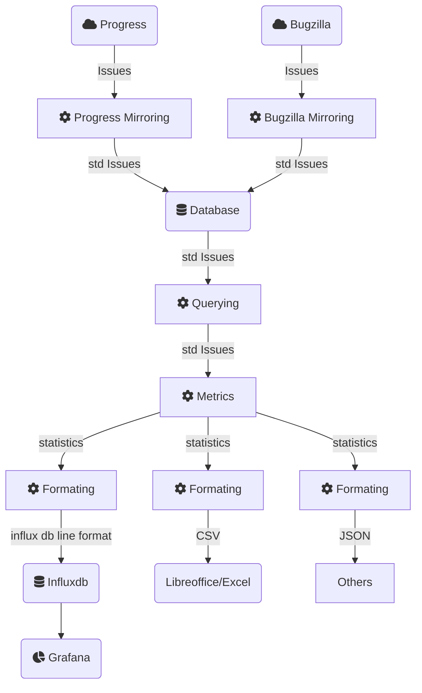

# project_management_statistics

## Structure



## Usage

### Dumping progress issues into local DB for further processing

1. Create the a redmine config file as a python file. e.g. `config.py`
2. define following variables in this file:
    - REDMINE_URL - URL to target Redmine from where tickets will be dumped
    - REDMINE_KEY - API key allowing to access REDMINE_URL
    - REDMINE_QUERY_RATIO - Max request per minute to the redmine API
    - MIRROR_SQLITE_DB - Sqlite file DB where tickets will be dumped
3. execute :

```bash
podman run  -ti --rm -v <your_redmine_config_path>:/pms/redmine/config.py pms "./dumper.py --project <project_name>"
```

## Querying

Import SQLiteQuery

```
from metrics.sqlite_query import SQLiteQuery
```

Create the object

```
query = SQLiteQuery(<file>)
```

### Methods


#### query.issues(**filters)
Get all issues
params:
* filter: A dict of filters e.g. project_id=1
return: A list of issues

#### query.status_snapshot(date, **filters)
Get all the active and resolved issues with the status in a especific moment
params:
* date (datetime): The date for the snapshot. None means the last values
* *filter: A dict of filters e.g. project_id=1
return: A list of issues

e.g.

```
result = query.status_snapshot(date=datetime(2023, 1, 1), project_id=1)
```

#### query.issues_active_in_period(date_in, date_out, **filters)
Get all the issues that are active (not closed) during a period of time
params:
* date_in (datetime): The begining of the period
* date_out (datetime): The end of the period
* filter: A dict of filters e.g. project_id=1
return: A list of issues


## Metrics

Import Metrics and SQLiteQuery if is necessary
```
from metrics.metrics import Metrics
from metrics.sqlite_query import SQLiteQuery
```

Create the objects
```
query = SQLiteQuery(<file>)
metrics = Metrics(query)
```

### Methods

#### metrics.status_count(**filters)
Classify the issues by status and return the ammount in each category
params:
* filter: A dict of filters e.g. project_id=1

return: A dict with the format <status_id:count>

### status_count_by_date(date, **filters)
Classify the issues by status and return the ammount in each category
params:
* filter: A dict of filters e.g. project_id=1

return: A dict with the format <status_id:count>


## Formater

```
from metrics.influxdb_formater import MetricsInfluxdbFormater
```

### Methods

#### format_dict(measurement_name, values, date, **filters)
Format a dictionary with the format key:value
params:
* measurement_name: Messurement name for the influx db
* values: the dictionary with the format <status_id:count>
* date: the date of the measurement
* filter: the filters used to obtain this messurement
return: A formated string


## Containers

### Create the containers

There are four alternatives:

- podman-container: Create the main container using podman
- podman-container-test: Create the container for testing using podman
- docker-container: Create the main container with docker
- docker-container-test: Create the container for testing using docker

e.g.

```bash
make docker-container
```

The containers created are:

- **pms**: For the main container
- **pms_test**: For the testing container

### Execution

With podman or docker

```bash
podman run --rm pms <command>
```

### Testing

With podman or docker

```bash
podman run --rm pms_test make test
```

### Development in a container

With podman or docker

```bash
podman run -ti --rm -v <your_code_path>:/pms pms_test bash
```

## Developer

### Prepare the venv

```bash
python3 -m venv venv
source venv/bin/activate
pip3 install -r requirements_test.txt
```

### Testing with redmine

If you have already a redmine/config.py skip this step
```bash
cp ./redmine/config_example.py ./redmine/config.py
```

Run the tests with
```bash
make test
```