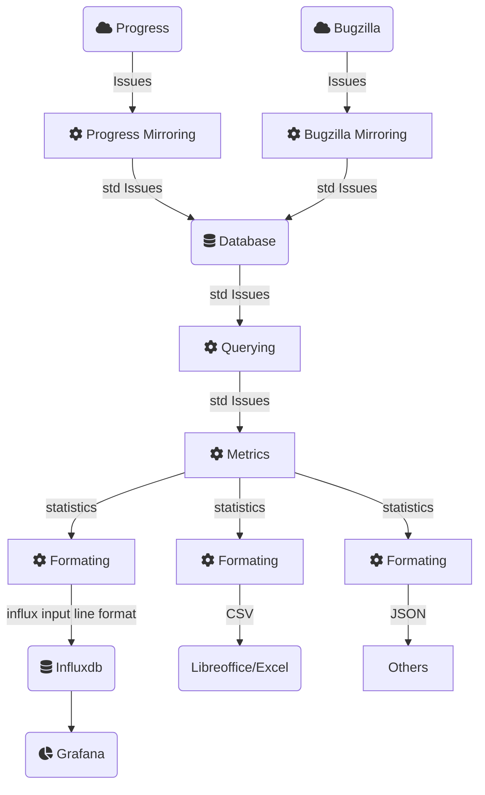

# Project Management Statistics

This project continues on [here](https://github.com/Jan-Stehlik-SUSE/project_management_statistics)
There won't be more updates in this fork

Taking a comprehensive approach, it's important to recognize that ticket systems such as Issues and IssueEvents usually only store raw data.
Through the processing and analysis facilitated by this project, we transform this data into valuable information 
that can be used for in-depth analysis or making informed decisions.

The motivation for this project is based on the challenges and limitations encountered while generating metrics using Telegraf and directly querying APIs.
These challenges highlight the need for a more efficient and robust solution to capture historical data and calculate meaningful metrics.

Telegraf serves its intended purpose effectively; however, the project we are proposing offers a potentially more effective and comprehensive solution 
for designing and exploring new metric formulas. By capturing and storing historical data, this project aims to enhance the process of generating metrics 
by addressing the limitations observed in the Telegraf approach.

The primary motivation for this project is the utilization of historical data, which offers several advantages when it comes to metrics.
Some key benefits of using historical data in this context include:

- **Efficient metric validation**: With historical information, you can validate metrics during the design phase,
leading to well-crafted metrics in production without waiting for days of collected data.
- **Consistent metric modification**: Historical data allows you to recalculate the entire metric with an updated formula, ensuring consistency throughout,
rather than having changes apply only from the moment of implementation.
- **Overcoming API limitations**: You can bypass API security restrictions and response speed constraints, enabling and speeding up the calculation of complex metrics.
- **Comprehensive metrics**: Unlike directly querying APIs and relying on the present moment, historical data offers a more comprehensive view of issue states, leading to more accurate metrics.
- **Resilience during downtime**: If a monitoring tool like Telegraf goes offline, historical data ensures that you won't miss any metrics generated during the downtime.
- **Advanced complexity and trend analysis**: Access to historical data enables the creation of complex metrics based on trends and issue evolution over time, offering deeper insights.

# Content of the documentation

Introduction
- [Features](#features)
- [Workflow](#workflow)
- [Why a normalized model](#why-a-normalized-model)

Specific documentation
  - [For users](docs/pages/users.md)
  - [For developers](docs/pages/developers.md)

Demos
  - [Demo and how to with grafana, influxdb and telegraf](docs/demo/README.md)

## Features

### Redmine Data dumping
- Configuration YAML file
  - Redmine URL and API key
  - Dumping ratio
  - Numeric status code to string transformation
- Entities dumped:
  - Issues: Standard information plus tags (extracted from events)
  - IssueEvents: All events
  - IssueRelations: All relations

### Metrics generation

#### Types of metrics
- Metrics by status

#### General
- Metrics by period
- Snapshot metrics (e.g. telegraf usage)
- Export to InfluxDB, CSV and JSON
- Basic filtering by: project, type, tags, context, status, priority, author, or assigned_to
- Advanced filtering using JSON schema
- Column selection and agregation
- YAML configuration file

### Bugzilla Data dumping
- Not functionl yet

## Workflow

This project uses a database schema to store and manage issues from different issue tracking systems. 
The schema is illustrated in the following diagram:

In this project, we follow a structured workflow to process and analyze data from different sources:

1. **Multiple data sources**: The data comes from various ticket systems, such as Progress and Bugzilla.
2. **Mirroring process**: We use mirroring scripts to process the raw data from these sources and store it in a common database using standardized models.
3. **Querying process**: We can query this database independently of the data source, enabling seamless access to the stored information.
4. **Metrics generation**: The metrics process takes the query result (standardized data) and generates relevant metrics based on our needs and requirements.
5. **Formatting and output**: Once the metrics have been generated, we format the results into a comprehensible output for different destinations.
This could include InfluxDB for visualization in Grafana, CSV files for use in spreadsheet applications like LibreOffice or Excel, or JSON files for integration 
with other applications that can read and process JSON data.

By following this workflow, we ensure a smooth and efficient process for handling, analyzing, and generating valuable information from raw data across multiple ticket systems.

### Why a normalized model

Using a database with a normalized model offers several benefits over directly connecting to APIs:

- **Enhanced performance**: By storing issues in a local (or remote) database, you can bypass limitations imposed by APIs, 
such as maximum query rates per second. This enables faster access to the information you need.
- **Scalable data retrieval**: By leveraging a database, you can fetch a larger number of issues per query,
allowing you to handle a growing number of tickets with ease. Avoiding an other one possible limitation of APIs.
- **Complete history for metric exploration**: A database enables you to store and maintain the complete history of issue changes for a project,
providing valuable context when exploring and designing new metrics. 
This comprehensive historical data allows you to instantly overview the evolution of a metric without waiting for additional data collection.
As a result, you can quickly refine and adjust the metric during the design phase, ensuring that it accurately reflects the desired insights and trends.
- **Simplified data extraction**: With a normalized model, you can consolidate multiple queries into a single request, 
streamlining the data extraction process and reducing the complexity of your code.
- **Cross-platform compatibility**: A normalized model ensures compatibility between different issue tracking systems,
making it easier to integrate multiple platforms and facilitating collaboration between teams using different tools.
- **Consistent data formats**: Normalizing the data in a database guarantees a consistent format for all issues,
simplifying data analysis and reporting while reducing the need for manual data normalization. 
This consistent format is beneficial not only for product owners and scrum masters who usally manage a single project,
but also for managers who need to maintain an overview of multiple projects across the department.
By having a unified data format, managers can efficiently track progress, evaluate performance, and make data-driven decisions across all projects,
ensuring better alignment with organizational goals and objectives.
